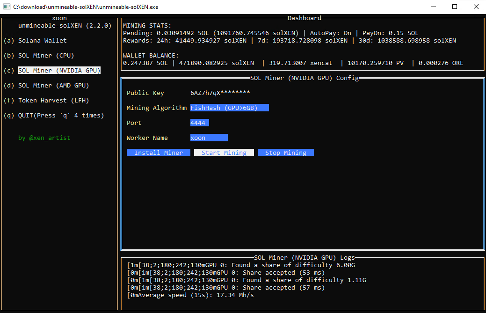
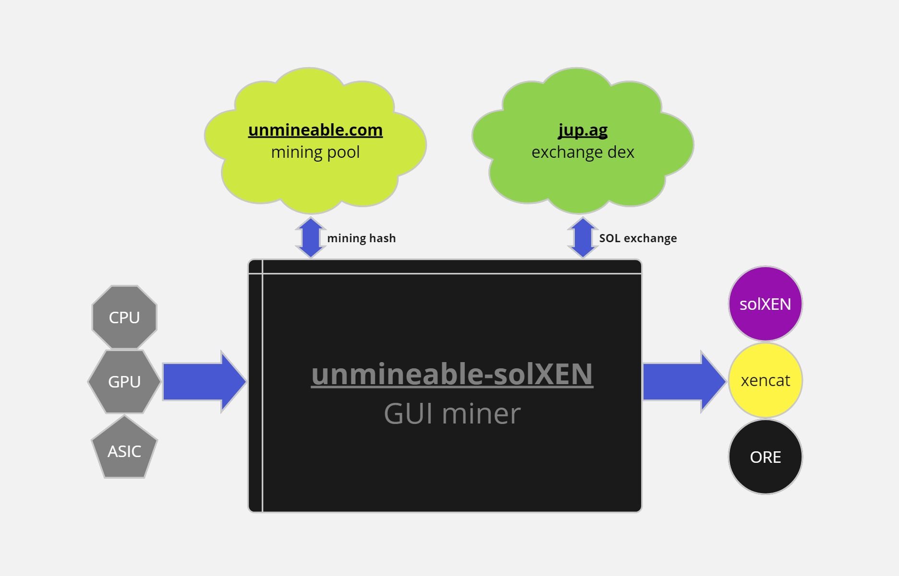
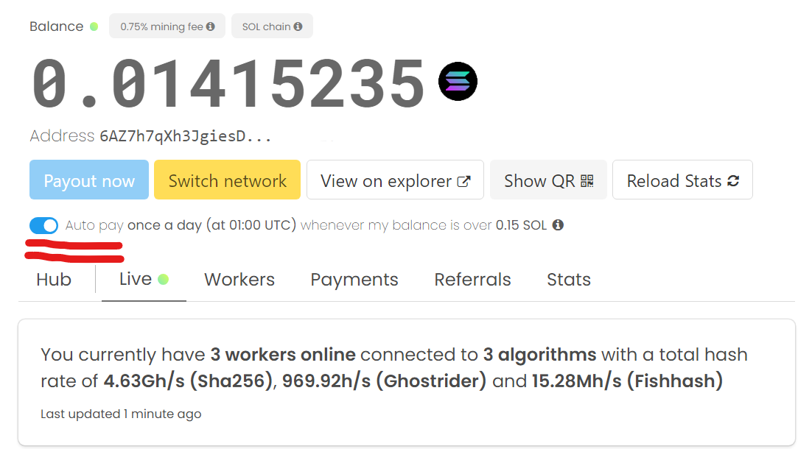

# unmineable-solXEN

GUI (TUI in terminal/console) mining [solXEN](https://solscan.io/token/6f8deE148nynnSiWshA9vLydEbJGpDeKh5G4PRgjmzG7) & targeting tokens by using CPU & GPU through [unmineable.com](https://unmineable.com/) and [jup.ag](https://jup.ag/)


 
  

## Screenshot



## Features



- [x] Both CPU & GPU mining are supported
- [x] Mining SOL through [unmineable.com](https://unmineable.com/)
- [x] Swap SOL to [solXEN](https://solscan.io/token/6f8deE148nynnSiWshA9vLydEbJGpDeKh5G4PRgjmzG7) through [jup.ag](https://jup.ag/) automatically
- [x] Swap SOL to targeting tokens through [jup.ag](https://jup.ag/) automatically
- [x] Password protected wallet
- [x] Mouse-click mining supported well
- [x] No SOL deposit required, just public key

## How to use unmineable-solXEN

### For Windows
1. Download the latest version of unmineable-solXEN from the [releases](https://github.com/xenartist/unmineable-solXEN/releases) page.
2. Extract the zip file.
3. Open the terminal, enter the folder and run the `unmineable-solXEN.exe` file.
```
cd unmineable-solXEN
.\unmineable-solXEN.exe
```
4. Create a new wallet.
5. Install the miner.
6. Start mining.

### For Linux
1. Download the latest version of unmineable-solXEN from the [releases](https://github.com/xenartist/unmineable-solXEN/releases) page.
```
wget https://github.com/xenartist/unmineable-solXEN/releases/download/some_version/unmineable-solXEN-linux-x64.tar.gz
```
2. Extract the tar.gz file.
```
tar -xzf unmineable-solXEN-linux-x64.tar.gz

cd unmineable-solXEN
```
3. Run the `unmineable-solXEN` file.
```
./unmineable-solXEN
```
4. Create a new wallet.
5. Install the miner.
6. Start mining.

### For Mac
1. Download the latest version of unmineable-solXEN from the [releases](https://github.com/xenartist/unmineable-solXEN/releases) page.
2. Extract the tar.gz file.
3. Open the terminal, enter the folder and run the `unmineable-solXEN` file.
```
cd unmineable-solXEN
./unmineable-solXEN
```
4. Create a new wallet.
5. Install the miner.
6. Start mining.

## solXENwallet

solXENwallet is encrypted by the password you set, public key and private key are both encrypted in the wallet file.

## Exporting the public key

You can export the public key by clicking the `Export Public Key` button.

This public key is used to mine SOL and receive the swaped solXEN.

## Exporting the private key

You can export the private key by clicking the `Export Private Key` button. (need to enter the password you set)

This private key in program (encrypted in memory as well) is used to sign the transactions to swap mined SOL to solXEN and OG solXEN automatically.

## unmineable.com mining status

You can check the mining status here https://unmineable.com/address/public_key?coin=SOL (replace `public_key` with your public key)

NOTE: Please ensure that the **"Auto Payout"** is enabled on the unmineable.com website, otherwise you won't be able to receive the mined SOL automatically.



## Credits

unmineable-solXEN: [xen_artist](https://x.com/xen_artist)

## License

gpl-3.0

